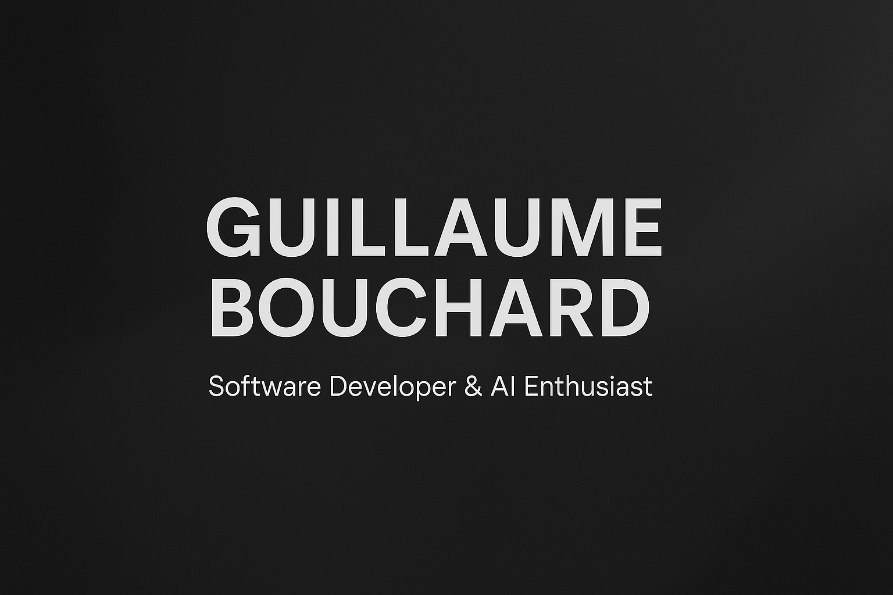

<h1 align="center">Hi, I'm Guillaume Bouchard</h1>

Full-Stack Developer · AI Explorer · Builder of AI Gallery, Nexa & More

  

---

### About Me

I'm a software developer and recent graduate of Algonquin College with a diploma in Computer Programming.  
My work focuses on full-stack applications, secure backend systems, and practical AI — blending clean architecture with engaging user experiences. I'm currently pursuing additional certifications to deepen my expertise.

From productivity tools like Nexa to logic-based agents in my AI Workshop, I enjoy building solutions that are both elegant and functional.

---

### Current Projects

- **Nexa** – Drag-and-drop productivity dashboard (Go + React + Tailwind)
- **Husband 4 Hire** – Agile-built job matching platform (Spring Boot + MySQL)
- **AI Workshop** – Collection of logic agents, search algorithms, and probabilistic models
- **Portfolio Website** – Clean personal portfolio built with Next.js and TailwindCSS

---

### Languages & Tools

  
  
  
  
  
  
  
  

---

### Contact

- Email: guillaumeb2004@hotmail.com  
- LinkedIn: [linkedin.com/in/guillaume-bouchard](https://www.linkedin.com/in/guillaume-bouchard)

---

### Fun Fact

Outside of programming, I’m a huge fan of cars, guitar, and building things that make life a little easier.  
I believe great software is both powerful and personal.
